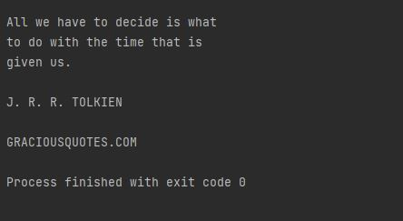

# text-extractor-from-image using Python 

### pip installs: pip install pytesseract

### Things to note:
* path_to_tesseract code: copy & paste the address file like r"C:\Program Files\Tesseract-OCR\tesseract.exe" in order for the app to work
* download [pytesseract](https://github.com/UB-Mannheim/tesseract/wiki) for windows. I don't use Mac, but if you do, just google search the download 

## Image:

## Output:

